# ProNeoH

## Git提交说明：


| 序号 | 标签     | 说明   |
| ---- | :------- | :----- |
| 1    | feat     | 新功能 |
| 2    | fix      | 修bug  |
| 3    | perf     | 优化   |
| 4    | test     | 测试   |
| 5    | refactor | 重构   |

## Rider设置：


| 序号 | 类别        | 说明         |
| ---- | :---------- | :----------- |
| 1    | 编码格式    | utf-8 NO BOM |
| 2    | Indent      | 4 spaces     |
| 3    | lua debuger | EmmyLua      |

> Editor->File Types->Lua language file 添加一下.lua.txt，我们的lua文件以.lua.txt为后缀

## 项目结构：

```
Assets
├── 3rdParty            // 第三方插件
├── _Test               // 测试场景
├── Editor       		// 编辑器
├── Plugins       		// plugin
├── GameAsset       	// 旧资源（待删除）
├── GameAssets       	// 资源目录
├── GameScripts         // 程序集目录
├   ├── Main            // 主程序程序集(启动器与流程)
├   └── HotFix          // 游戏热更程序集目录 [Folder]
├       ├── GameBase    // 游戏基础框架程序集 [Dll]
├       └── GameLogic   // 游戏业务逻辑程序集 [Dll]
├           ├── GameApp.cs                  // 热更主入口
├           └── GameApp_RegisterSystem.cs   // 热更主入口注册系统   
├── TEngine
	├── Editor          // TEngine编辑器核心代码 [禁止编辑]
	└── Runtime         // TEngine运行时核心代码 [禁止编辑]
```

## 代码规范：

* 命名规范：

  1. 类命名：驼峰式命名：单词首字母大写，如：BaseClass
  2. 公有函数命名：驼峰式命名	GetInstance
  3. 私有函数命名：驼峰式命名	_getInstance
  4. 公有变量命名：驼峰式命名	Instance
  5. 私有变量命名："_"开头，接小驼峰或者"_"分隔，如：self._action_list或 self._actionList
  6. 局部变量命名：小驼峰	如：actionList或action_list
  7. 参数名命名：同局部变量
  8. 由于脚本语言没有跳转功能，最好在实例前添加类型，提高可读性：
     ~~~
     --- @type 数据类型
     声明type的方式：
     --- @class xxx
     --- @field xxx
     ~~~
  9. 所有UI脚本以UI打头，即UIxxxx
  10. 系统功能扩展函数：全部使用小写，不用下划线，如对table的扩展：table.walksort
  11. 所有协程函数体以"Co"打头，如：CoAsyncLoad，表示该函数必须运行在协程中，并且可以使用任意协程相关函数
  12. 所有Unity Object均使用全局函数IsNull判空===>***很重要
* 全局变量的使用规范

  ~~~
  全局变量赋值加_G
  _G.xxx = 0
  _G.xxx = {}
  全局变量访问不用_G
  print(xxx)
  ~~~
* 配置表读取

  ~~~
  -- 有三种方式
  -- 举例 读取 Item_Info 表
  Cfg.Item_Info()							--获取全表
  Cfg.Item_Info[id]						--获取表中对应id的数据
  Cfg.Item_Info{type = 1, name = "xxx"}	--根据条件查找 返回数组
  ~~~
* 数据类定义和使用

  ~~~
  ---@class ChatView
  local M = class("ChatView")

  ---@class ChatView:UIPanel
  local M = class("ChatView", UIPanel)
  ~~~
* UI窗口代码规范

  1. 严格遵守MVC架构：Model层数据、View层窗口组件操作、Ctrl层数据操作
  2. View层直接依赖Ctrl层，间接依赖Model层（只读）；Ctrl层依赖Model层；Model层不依赖Ctrl和View层
  3. Ctrl层没有状态，可以操作游戏逻辑和Model层数据；View层除了读取配置表，不能直接操作任何游戏逻辑
  4. 逻辑的运行不能依赖窗口的Ctrl层，如果需要这样的控制代码，写到游戏逻辑模块中
  5. 窗口Model层不存游戏数据，它的生命周期是和窗口绑定在一起的，只能缓存用户操作，比如：当前选择了那个服务器做登陆服务器
  6. 窗口Model层是针对窗口的数据，是游戏数据中心的一个抽取，比如数据中心UserData可能包括用户名、背包、Vip、英雄等等数据，但是用于界面可能只是从用户名、Vip提取部分数据展示
  7. UI组件代码所有函数的执行规律同Unity脚本，UI声明周期有固定的函数

  > TODO：
  >

  1. 所有需要调度和管理的UI组件最好使用Lua侧封装的各种UIComponent，不要直接使用Unity侧的UI原生组件，否则不受Lua侧组件系统调度管理，需自行管理
  2. 原则上尽量对UI组件执行封装：一是可以简化逻辑层脚本使用方式，二是可以利用缓存尽量减少lua与cs交换，提升性能
* 工具类代码规范

  1. 所有和UI界面相关的公共函数添加到UIUtils
  2. 所有和Lua语言直接相关的公共函数添加到LuaUtils
  3. 所有对table操作的扩展函数添加到TableUtils

## UI规范：
* UI切图命名
1. 模块名_bg_xxx       背景
1. 模块名_img_xxx      图片
1. 模块名_icon_xxx     当前界面用到的小图标
1. 模块名_language_xxx 文字
    ~~~
    如果是子界面，前缀改为 模块名_子界面
    ~~~

* UI界面结构
1. 背景图节点命名： BG

## UIPrefab组件命名：


| 类型                  | 命名          | 说明    |
| --------------------- | ------------- | ------- |
| Button                | m_btn_xxx     | 按钮    |
| TextMeshProUGUI       | m_txt_xxx     | 文本    |
| Image                 | m_img_xxx     | 图片    |
| RawImage              | m_rimg_xxx    | Raw图片 |
| GameObject            | m_go_xxx      | go      |
| UIMultiScroller       | m_scr_xxx     |         |
| Transform             | m_tra_xxx     |         |
| RectTransform         | m_rect_xxx    |         |
| Slider                | m_sld_xxx     |         |
| Toggle                | m_tog_xxx     |         |
| ToggleGroup           | m_toggr_xxx   |         |
| Animation             | m_ani_xxx     |         |
| Animator              | m_ant_xxx     |         |
| TMP_InputField        | m_input_xxx   |         |
| Mask                  | m_mask_xxx    |         |
| RectMask2D            | m_mask2d_xxx  |         |
| ScrollRect            | m_srect_xxx   |         |
| Scrollbar             | m_sbar_xxx    |         |
| Dropdown              | m_drop_xxx    |         |
| Canvas                | m_canvas_xxx  |         |
| CanvasGroup           | m_cgroup_xxx  |         |
| GridLayoutGroup       | m_grid_xxx    |         |
| HorizontalLayoutGroup | m_hlayout_xxx |         |
| VerticalLayoutGroup   | m_vlayout_xxx |         |
| ContentSizeFitter     | m_csf_xxx1    |         |

使用这些命名，直接拖进LuaBehaviour中，自动绑定，不需要手动绑定
补充的通用组件：UIPanelCreator.TypeMap

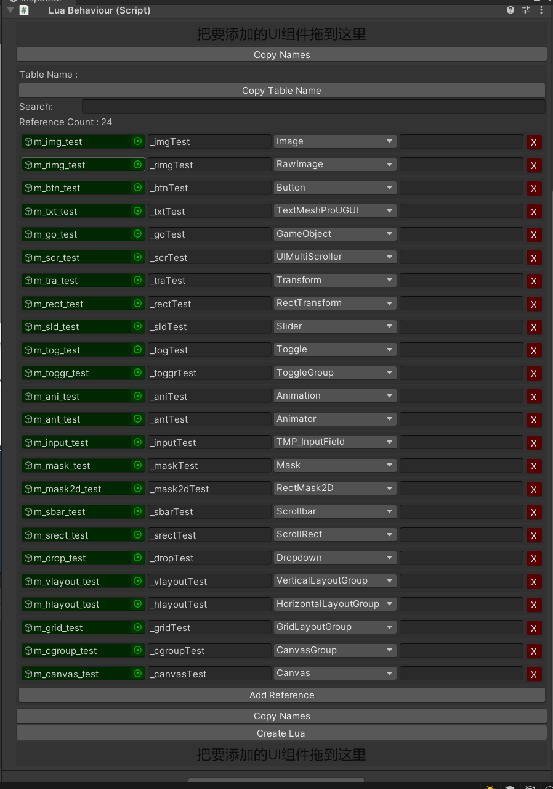

## UI通用组件(Component)：

* 字体描边投影等：UI_FontGroundInstantiate
* 按钮放大缩小：ButtonHandler
* 自定义滑动列表：UIMultiScroller (支持横向、纵向、网格、循环滚动)

### 通用Tips:

### 飘文字


```lua
UITipsUtils:ShowTips("测试")
UITipsUtils:ShowTipsByTid("Tid_common_cost", "钻石", 100)
UITipsUtils:ShowTips("测试图文混排100")
```

### 通用信息弹窗

```lua
UITipsUtils:ShowMessage(nil,
        "测试图文混排100",
        nil, nil, nil, nil, true)
```

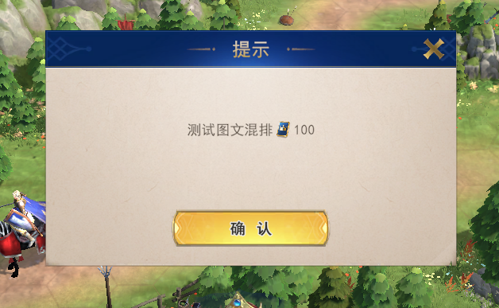

```lua
UITipsUtils:ShowMessageOptionView("测试", "测试图文混排100", function()
    print_error("test")
end, "test", nil, nil)
```

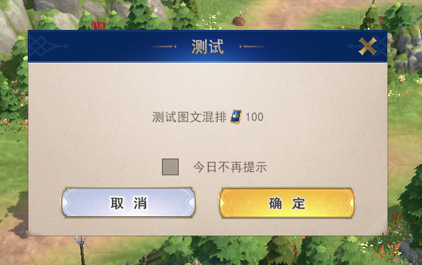

### 通用纯描述弹框

```lua
UITipsUtils:ShowDesc(desc, title)
```

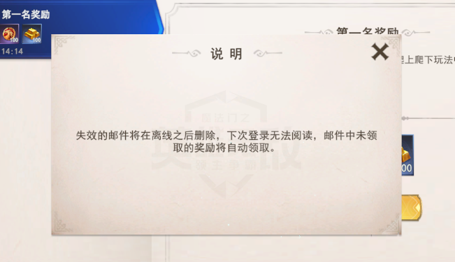

### 通用奖励弹板

#### 样式1：半屏弹窗

```lua
---样式1 :
UIUtils:ShowCommonRewardDialog( {{1,1001, 1000}, {1,1002, 1000}, {1,1003, 1000}, {1,1004, 1000}}, function()
  print_error("test common RewardDialog")
end, nil, RewardDefines.RewardDataType.RewardCfg)
```

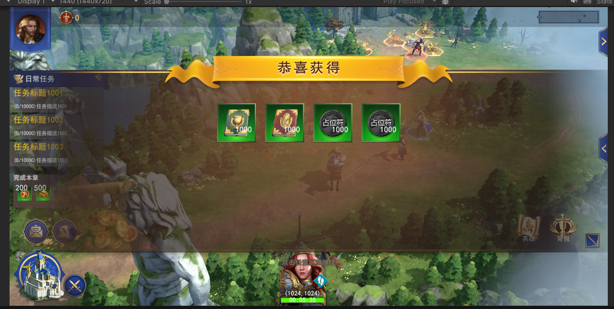

#### 样式2：全屏弹窗

```lua
UIUtils:ShowCommonRewardView( {{1,1001, 1000}, {1,1002, 1000}, {1,1003, 1000}, {1,1004, 1000}}, function()
  print_error("test common RewardDialog")
end, nil, RewardDefines.RewardDataType.RewardCfg)
```

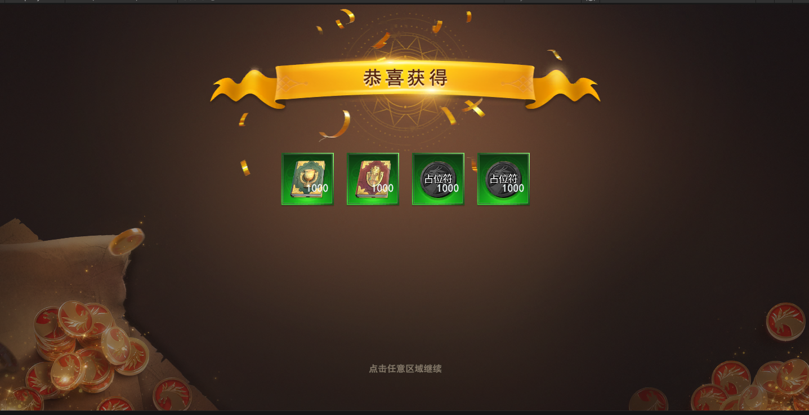

### 界面Goto

#### 例如任务界面 UITaskView_3，打开任务界面，并选中页签类型为3的页签

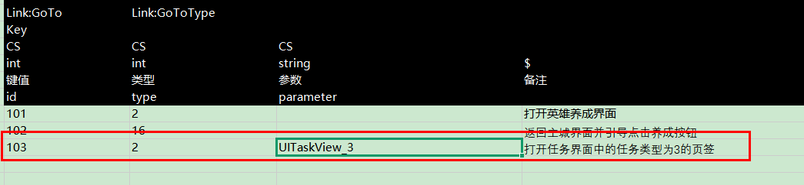

#### 1.重写OnParseGoto方法，解析goto参数，定好规则，让策划根据规则配置界面goto参数

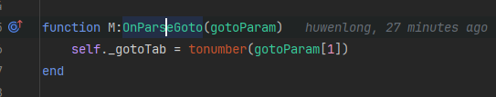

#### 2.在OnRefresh中实现相关goto的方法，以确保第一次打开或者已开启的界面，跳转都能执行到

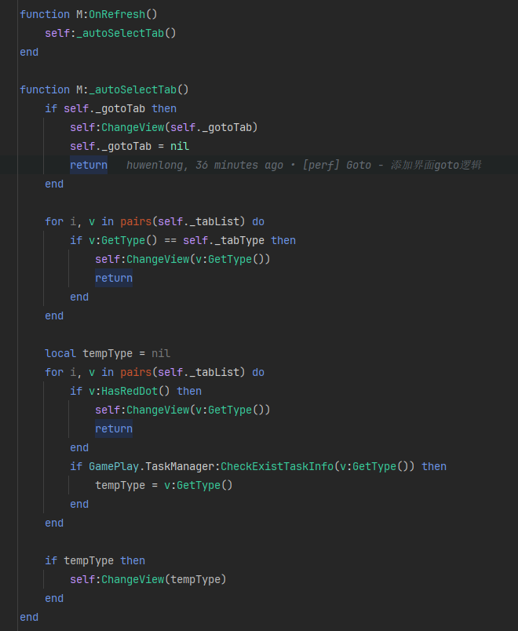

### 通用奖励消耗道具

#### 1.通用数据结构

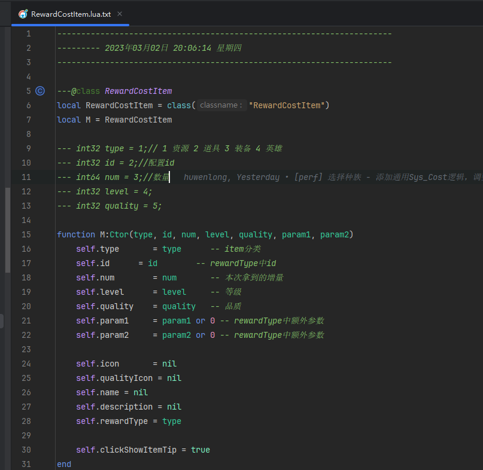

##### 获取图标 GetIcon

##### 获取数量 GetCount

##### 获取拥有数量 GetOwnCount

##### 获取名称 GetName

##### 获取描述 GetDescription

#### 2.奖励解析

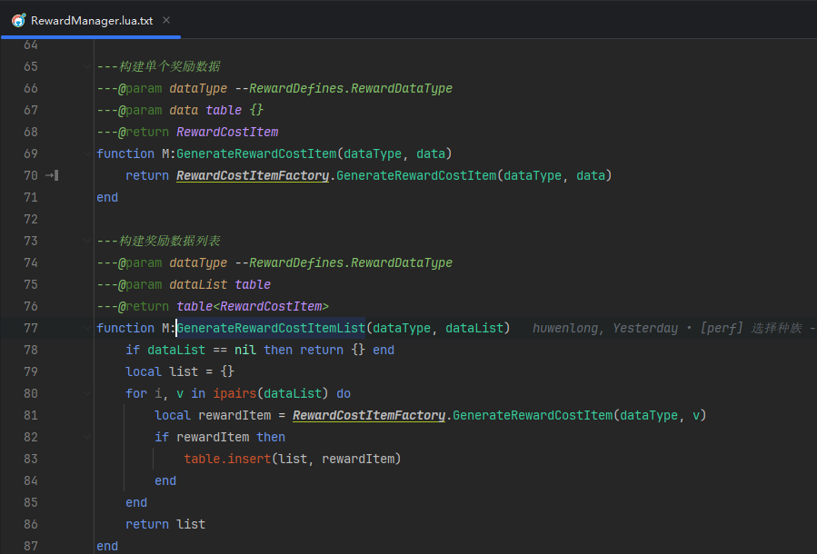

##### dataType 是 RewardDefines.RewardDataType枚举，Server为服务器奖励数据，Config为配置表数据（奖励或消耗）

##### data 是奖励/消耗配置数据

#### 3.通用道具

##### 奖励道具 UIBaseItem

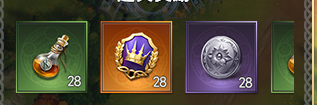

##### 消耗图标道具 UIBaseIconItem

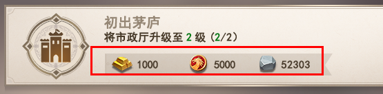


### Button使用

#### C#使用UIButtonSuper组件

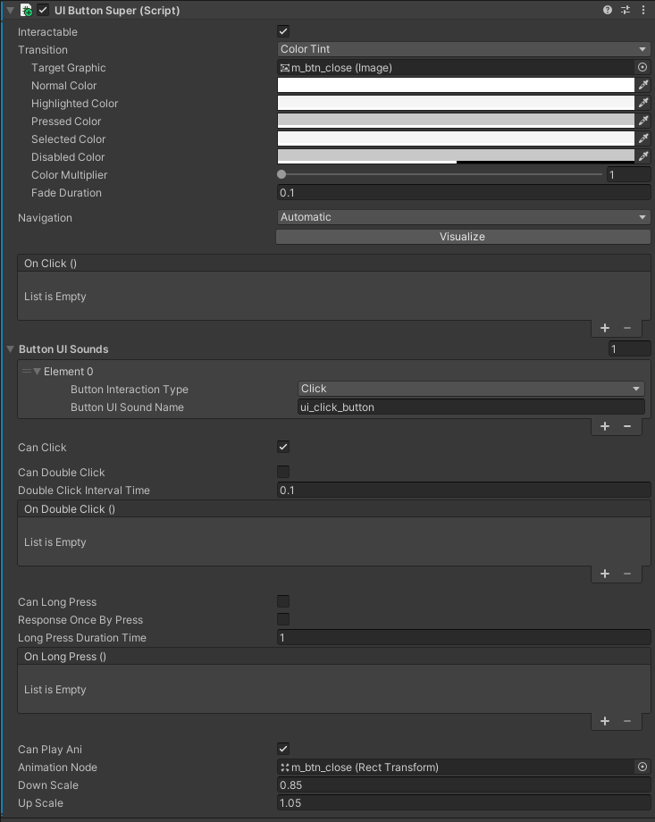

#### 右键Create快速创建Button

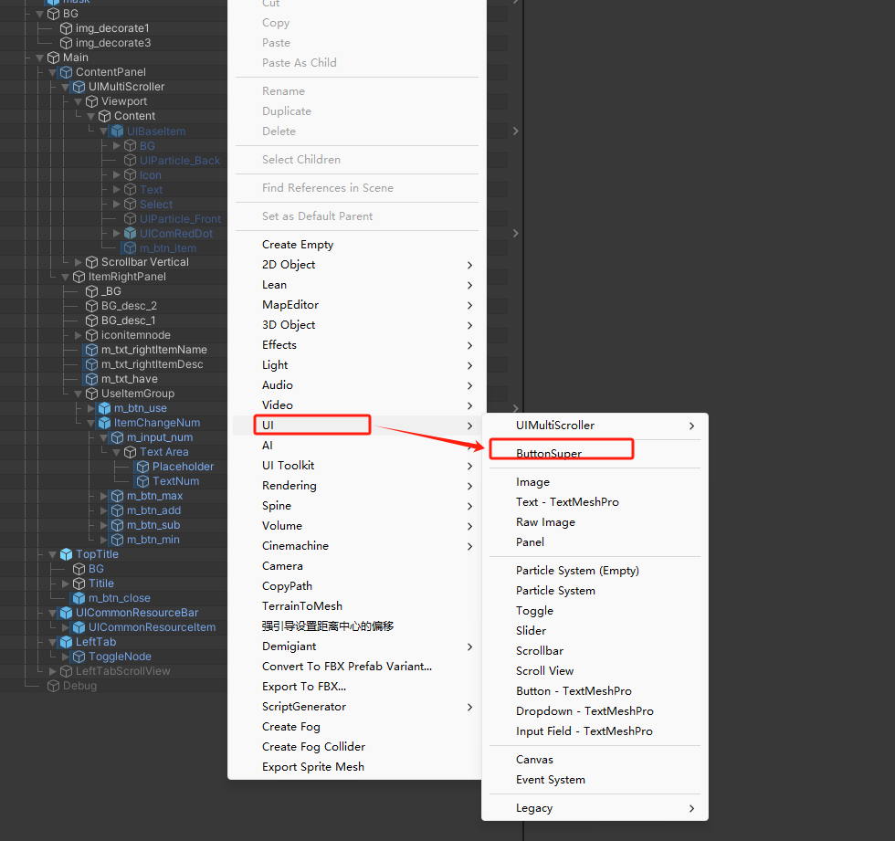

#### Lua使用UIButton.lua
- LuaBehavior注册时，自动生成UIButton对象并绑定UIButtonSuper组件

##### 常用接口
- AddClickEvent 注册点击事件
- AddDoubleClickEvent 注册双击事件
- AddLongPressEvent 注册长按事件
- RemoveAllEvent 移除所有事件
- SetGray 置灰 参数 isGray 是否置灰， interactable 是否可点击

### UIFullScreenPanel
#### 选中UIContainer节点，右键 UI 创建 UIFullScreenPanel
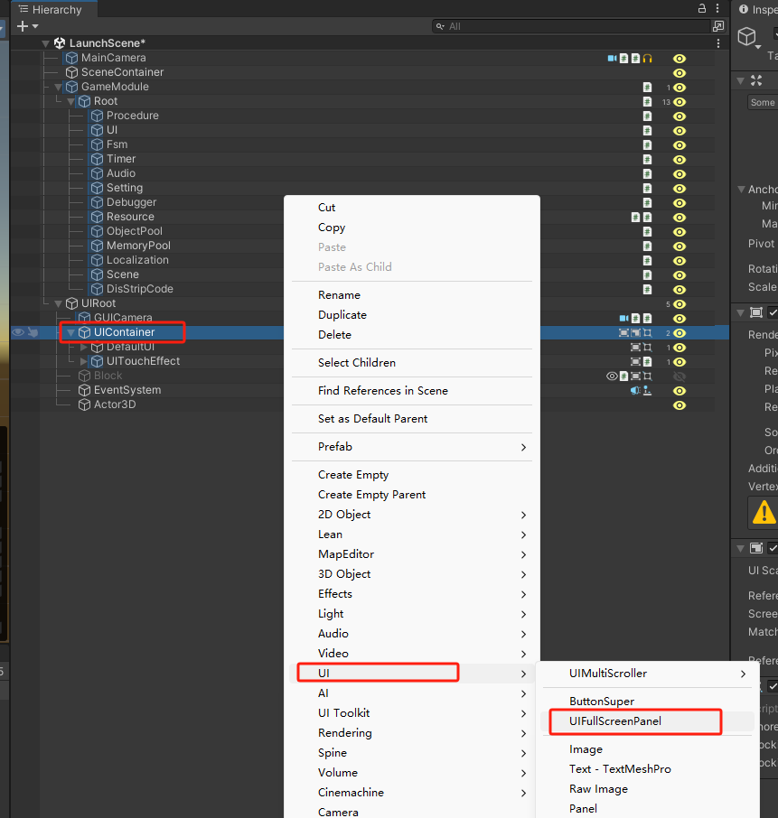
#### 节点解释
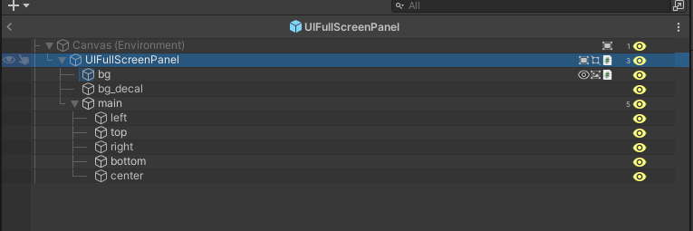

- bg 全屏背景图 根据设备分辨率 拉伸适配
- bg_decal 背景图上的贴花，小图标（以1440 * 720 进行适配）
- left 左侧锚点节点
- top 顶部锚点节点
- right 右侧锚点节点
- bottom 底部锚点节点
- center 居中锚点节点